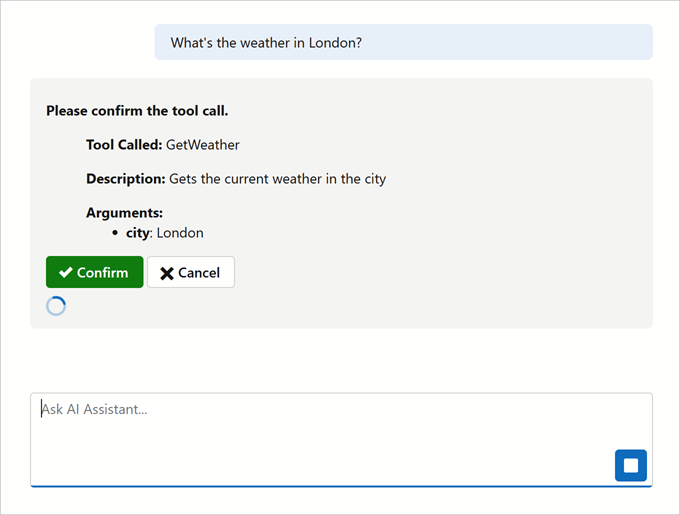

<!-- default badges list -->

[](https://supportcenter.devexpress.com/ticket/details/T1304035)
[](https://docs.devexpress.com/GeneralInformation/403183)
[](#does-this-example-address-your-development-requirementsobjectives)
<!-- default badges end -->
# Blazor AI Chat — Confirm Tool Calls

In AI-powered applications, tool or function calls can execute sensitive operations without user awareness (such as modifying data or sending requests).

This example adds a **tool call confirmation** layer to the DevExpress Blazor AI Chat component. The chat intercepts AI-initiated tool calls, displays a confirmation dialog, and proceeds with user approval.



## Prerequisites

* .NET 8+ SDK
* Visual Studio 2022, JetBrains Rider, or Visual Studio Code with C# extension
* Azure OpenAI Service access (API key and endpoint)

## Setup and Configuration

1. Configure your Azure OpenAI credentials as environment variables:

    ```bash
    # Windows (Command Prompt)
    set AZURE_OPENAI_ENDPOINT=https://your-instance.openai.azure.com/
    set AZURE_OPENAI_API_KEY=your-api-key-here

    # Windows (PowerShell)
    $env:AZURE_OPENAI_ENDPOINT="https://your-instance.openai.azure.com/"
    $env:AZURE_OPENAI_API_KEY="your-api-key-here"

    # macOS/Linux
    export AZURE_OPENAI_ENDPOINT="https://your-instance.openai.azure.com/"
    export AZURE_OPENAI_API_KEY="your-api-key-here"
    ```
2. Set the `deploymentName` in [Program.cs](./CS/Program.cs) to your model's deployment name:

    ```csharp
    string deploymentName = "your-model-name";
    ```

## Implementation Details

### Manage Tool Calls

The `IToolCallFilter` interface is designed to manage AI tool calls before they are executed. Implement this interface to display confirmation dialogs, log decisions, or enable security control (enforce user approval, track usage, prevent unintended operations, etc.).

```csharp
public interface IToolCallFilter {
    public event Action<FunctionInvocationContext, TaskCompletionSource<bool>> ToolCalled;
    
    /// <summary>
    /// Invokes the FunctionInvoked event if handlers are attached
    /// </summary>
    Task<bool> InvokeFunctionFilter(FunctionInvocationContext context);
}
```

The `MyToolCallFilter` manages AI-triggered actions, ensuring that sensitive operations are only executed when approved.

```csharp
public class MyToolCallFilter : IToolCallFilter {
    public event Action<FunctionInvocationContext, TaskCompletionSource<bool>>? ToolCalled;

    /// <summary>
    /// Invokes the FunctionInvoked event if handlers are attached
    /// </summary>
    public Task<bool> InvokeFunctionFilter(FunctionInvocationContext context) {
        if (ToolCalled is null)
            return Task.FromResult(true);

        var tcs = new TaskCompletionSource<bool>();
        ToolCalled.Invoke(context, tcs);
        return tcs.Task;
    }
}
```

### Confirm Tool Calls

The `FunctionInvokingChatClient` extends the default behavior that invokes tools. It intercepts AI tool calls, checks for confirmation logic, and only proceeds with user approval.

```csharp
public class CustomFunctionInvokingChatClient : FunctionInvokingChatClient {
    public CustomFunctionInvokingChatClient(IChatClient innerClient, ILoggerFactory? factory = null,
        IServiceProvider? services = null)
        : base(innerClient, factory, services) {
        if(services == null) {
            throw new ArgumentNullException(nameof(services), "Service provider cannot be null.");
        }
        FunctionInvoker = CustomFunctionInvoker;
    }

    private async ValueTask<object?> CustomFunctionInvoker(FunctionInvocationContext context, CancellationToken cancellationToken) {
        IToolCallFilter? filter = FunctionInvocationServices!.GetService<IToolCallFilter>();

        if(await (filter?.InvokeFunctionFilter(context) ?? Task.FromResult(true))) {
            return await context.Function.InvokeAsync(context.Arguments, cancellationToken);
        }

        return null;
    }
}
```

### Confirmation Dialog

This example displays the following dialog to confirm tool calls:


```razor
@if(_pendingTcs != null) {
    <div>
        @if(_pendingContext != null) {
            <p><strong>Please confirm the tool call.</strong></p>
            <blockquote>
                <p><strong>Tool Called:</strong> @_pendingContext.Function.Name</p>
                <p><strong>Description:</strong> @_pendingContext.Function.Description</p>
            </blockquote>
            <blockquote>
                <strong>Arguments:</strong>
                <ul>
                    @foreach(var arg in _pendingContext.Arguments) {
                        <li><strong>@arg.Key</strong>: @arg.Value</li>
                    }
                </ul>
            </blockquote>
        }

        <DxButton Text="Confirm"
                  RenderStyle="ButtonRenderStyle.Success"
                  IconCssClass="oi oi-check"
                  Click="() => OnDecisionMade(true)" />
        <DxButton Text="Cancel"
                  RenderStyle="ButtonRenderStyle.Secondary"
                  IconCssClass="oi oi-x"
                  Click="() => OnDecisionMade(false)" />
    </div>
}
```

The following code handles the confirmation workflow:

```razor
@code {
    private FunctionInvocationContext? _pendingContext;
    private TaskCompletionSource<bool>? _pendingTcs;
    [Inject] IToolCallFilter? ToolCallFilter { get; set; }

    protected override void OnInitialized() {
        if(ToolCallFilter != null) {
            ToolCallFilter.ToolCalled += OnFunctionInvoked;
        }
    }

    private void OnFunctionInvoked(FunctionInvocationContext context, TaskCompletionSource<bool> tcs) {
        _pendingContext = context;
        _pendingTcs = tcs;
        StateHasChanged();
    }

    private void OnDecisionMade(bool decision) {
        _pendingTcs!.SetResult(decision);
        _pendingContext = null;
        _pendingTcs = null;
    }

    public void Dispose() {
        if(ToolCallFilter != null) {
            ToolCallFilter.ToolCalled -= OnFunctionInvoked;
        }
    }
}
```

Use the `MessageContentTemplate` to display **Confirm** and **Cancel** buttons when the AI Chat is in 'typing' state:

```razor
<DxAIChat CssClass="main-content">
    <MessageContentTemplate Context="context">
        @context.Content
        @if(context.Typing) {
            <ConfirmationButtons />
        }
    </MessageContentTemplate>
</DxAIChat>
```

### Register `MyToolCallFilter` and Chat Client Service

Register `MyToolCallFilter`  and `IChatClient` in the dependency injection (DI) container for each user session.

```csharp
//Replace with your endpoint, API key, and deployed AI model name.
string azureOpenAIEndpoint = Environment.GetEnvironmentVariable("AZURE_OPENAI_ENDPOINT");
string azureOpenAIKey = Environment.GetEnvironmentVariable("AZURE_OPENAI_API_KEY");
string deploymentName = string.Empty;

// Add services to the container.
builder.Services.AddRazorComponents()
    .AddInteractiveServerComponents();

builder.Services.AddDevExpressBlazor();
builder.Services.AddMvc();

var azureChatClient = new AzureOpenAIClient(
    new Uri(azureOpenAIEndpoint),
    new AzureKeyCredential(azureOpenAIKey)).GetChatClient(deploymentName).AsIChatClient();

builder.Services.AddScoped<IToolCallFilter, MyToolCallFilter>();

builder.Services.AddScoped(x => {
    return new ChatClientBuilder(azureChatClient)
        .ConfigureOptions(x =>
        {
            x.Tools = [CustomAIFunctions.GetWeatherTool];
        })
        .UseMyToolCallConfirmation()
        .Build(x);
});

builder.Services.AddDevExpressAI();
```

### Fluent API Extension

Fluent API allows you to confirm tool calls in a single line of configuration when building the chat client:

```csharp
public static class CustomFunctionInvokingChatClientExtensions {
    public static ChatClientBuilder UseMyToolCallConfirmation(this ChatClientBuilder builder, ILoggerFactory? loggerFactory = null) {
        return builder.Use((innerClient, services) => {
            loggerFactory ??= services.GetService<ILoggerFactory>();
            var chatClient = new CustomFunctionInvokingChatClient(innerClient, loggerFactory, services);
            return chatClient;
        });
    }
}
```

## Files to Review

- [Program.cs](./CS/Program.cs)
- [CustomFunctionInvokingChatClient.cs](./CS/Services/CustomFunctionInvokingChatClient.cs)
- [IToolCallFilter.cs](./CS/Services/IToolCallFilter.cs)
- [ToolCallFilter.cs](./CS/Services/ToolCallFilter.cs)
- [CustomFunctionInvokingChatClientExtensions.cs](./CS/Services/CustomFunctionInvokingChatClientExtensions.cs)
- [ConfirmationButtons.razor](./CS/Components/ConfirmationButtons.razor)
- [Index.razor](./CS/Components/Pages/Index.razor)

## Documentation

- [DevExpress AI-powered Extensions for Blazor](https://docs.devexpress.com/Blazor/405228/ai-powered-extensions)
- [DevExpress Blazor AI Chat Control](https://docs.devexpress.com/Blazor/DevExpress.AIIntegration.Blazor.Chat.DxAIChat)
- [DevExpress Blazor Form Layout](https://docs.devexpress.com/Blazor/DevExpress.Blazor.DxFormLayout)
- [DevExpress Blazor Button Component](https://docs.devexpress.com/Blazor/DevExpress.Blazor.DxButton)
- [Microsoft.Extensions.AI Documentation](https://learn.microsoft.com/en-us/dotnet/ai/microsoft-extensions-ai)

## More Examples

- [Blazor AI Chat — Add the DevExpress Blazor AI Chat component to your application](https://github.com/DevExpress-Examples/devexpress-ai-chat-samples)
- [Blazor AI Chat — Implement function/tool calling](https://github.com/DevExpress-Examples/blazor-ai-chat-function-calling)
- [Blazor AI Chat — Build a multi-LLM chat application](https://github.com/DevExpress-Examples/blazor-ai-chat-with-multiple-llm-services)
- [Rich Text Editor and HTML Editor for Blazor — Integrate AI-powered extensions](https://github.com/DevExpress-Examples/blazor-ai-integration-to-text-editors)

<!-- feedback -->
## Does this example address your development requirements/objectives?

[](https://www.devexpress.com/support/examples/survey.xml?utm_source=github&utm_campaign=blazor-ai-chat-confirm-tool-calls&~~~was_helpful=yes) [](https://www.devexpress.com/support/examples/survey.xml?utm_source=github&utm_campaign=blazor-ai-chat-confirm-tool-calls&~~~was_helpful=no)

(you will be redirected to DevExpress.com to submit your response)
<!-- feedback end -->


